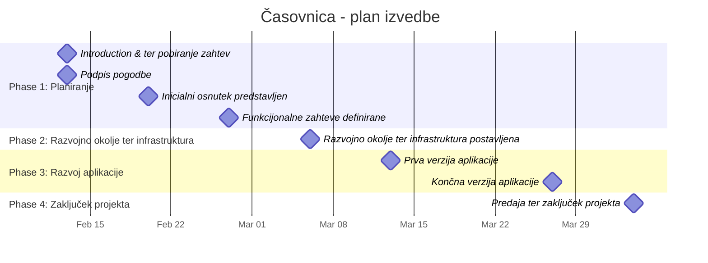

# Plan izvedbe - Milestones

## Milestone Details

1. **Introduction ter pobiranje zahtev v sodelovanju s Iskriva ter partnerji**
   - Due date: Fri, Feb 13, 2026

2. **Inicialen osnutek izgleda aplikacije predstavljen**
   - Due date: Fri, Feb 20, 2026

3. **Funkcijonalne zahteve definirane**
   - Due date: Fri, Feb 27, 2026

4. **Razvojno okolje ter infrastruktura postavljena** (strežniki, baza, itd.)
   - Due date: Fri, Mar 6, 2026

5. **Prva verzija aplikacije**
   - Due date: Fri, Mar 13, 2026

6. **Končna verzija aplikacije**
   - Due date: Fri, Mar 27, 2026

7. **Predaja ter zaključek projekta**
   - Due date: Fri, Apr 3, 2026
